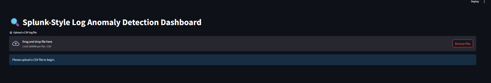

# 🧠 Splunk AI Anomaly Detection

This project leverages **machine learning (Isolation Forest)** to detect **anomalous login behavior** from Splunk-style logs. Built using **Streamlit**, it provides a lightweight and interactive dashboard for threat hunters and analysts.

   

---

## 🚀 Features

* 📤 **Upload CSV logs** (mimicking Splunk API export)
* 🧠 **Anomaly detection** using unsupervised learning (Isolation Forest)
* 📊 **Interactive dashboard**: filters by user, IP, action, date
* 📈 **Visual analytics**: Hourly anomalies, top users, IPs, and actions
* 📁 **Download filtered anomalies** as CSV
* 🔁 Optional: **Integrate back into Splunk or SIEM**

---

## 📂 Project Structure

```
splunk-ai-anomaly/
├── dashboard.py               # Streamlit dashboard frontend
├── utils/
│   └── predict.py             # AI model: train + predict
├── data/
│   └── simulated_auth_logs.csv (optional sample)
├── requirements.txt
└── README.md
```

---

## 🛠 Setup Instructions

### 🔧 1. Install Dependencies

```bash
pip install -r requirements.txt
```

> Or manually:
> `pip install pandas scikit-learn streamlit`

---

### 🚦 2. Run the Dashboard

```bash
streamlit run dashboard.py
```

Then upload a CSV log file in this format:

```csv
timestamp,user,src_ip,action
2025-06-01 12:34:56,admin,192.168.1.100,success
...
```

---

## 📊 Sample Dashboard Views

| Visual                         | Insight                                  |
| ------------------------------ | ---------------------------------------- |
| Bar chart of anomalies by hour | Detect brute-force attempts at odd hours |
| Top users and IPs              | Identify repeated offenders or bots      |
| Filtered download              | Export data for reporting or triage      |

---

## 🎬 Demo



---

## 🔐 No Real Splunk Needed

This project **simulates Splunk-style log ingestion and detection**, making it perfect for:

* Learning anomaly detection
* Training SOC/IR teams
* Building your GitHub portfolio

---

## ✅ Coming Soon (Ideas for Expansion)

* 📡 Real-time ingestion using Splunk API
* 📈 Time series-based anomaly scoring
* 🧠 Add LSTM or AutoEncoder models
* 📤 Re-ingestion of anomalies into Splunk via HEC

---

## 🤝 Contributions Welcome

Found a bug? Want to add a feature? Feel free to open an issue or pull request!